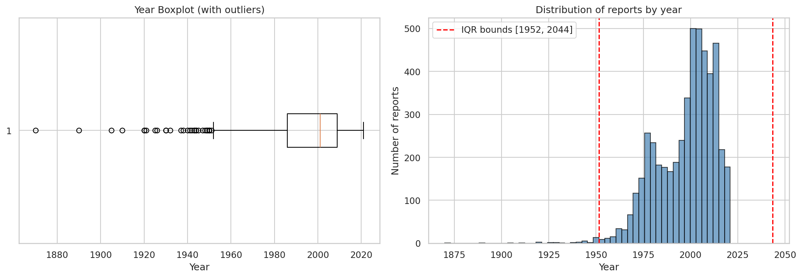
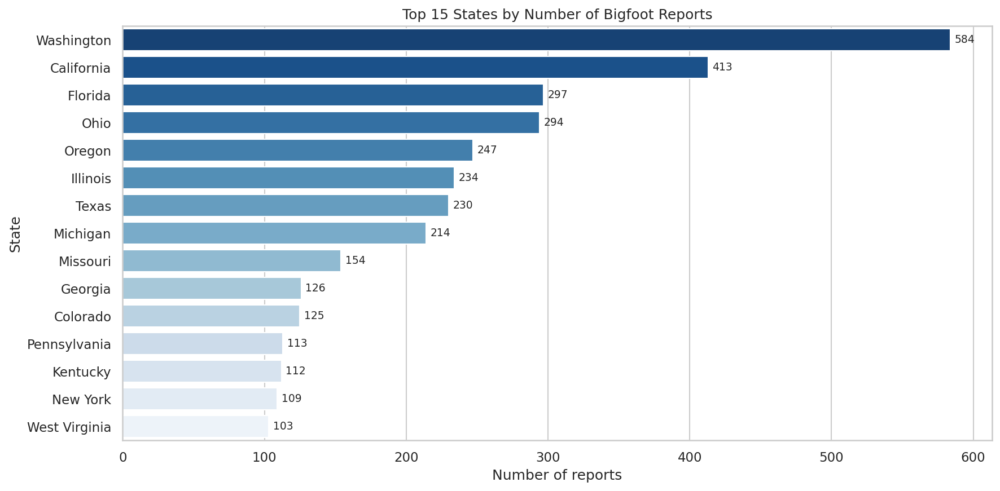
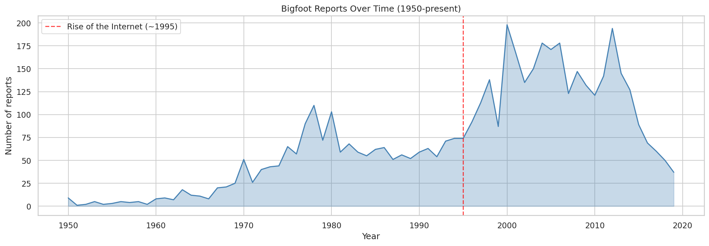
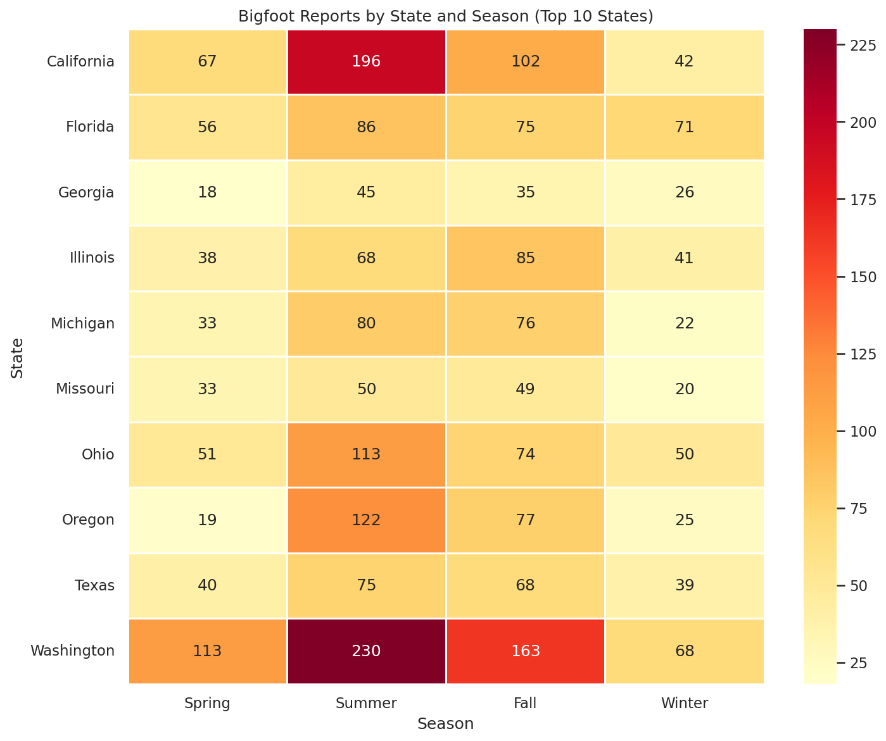
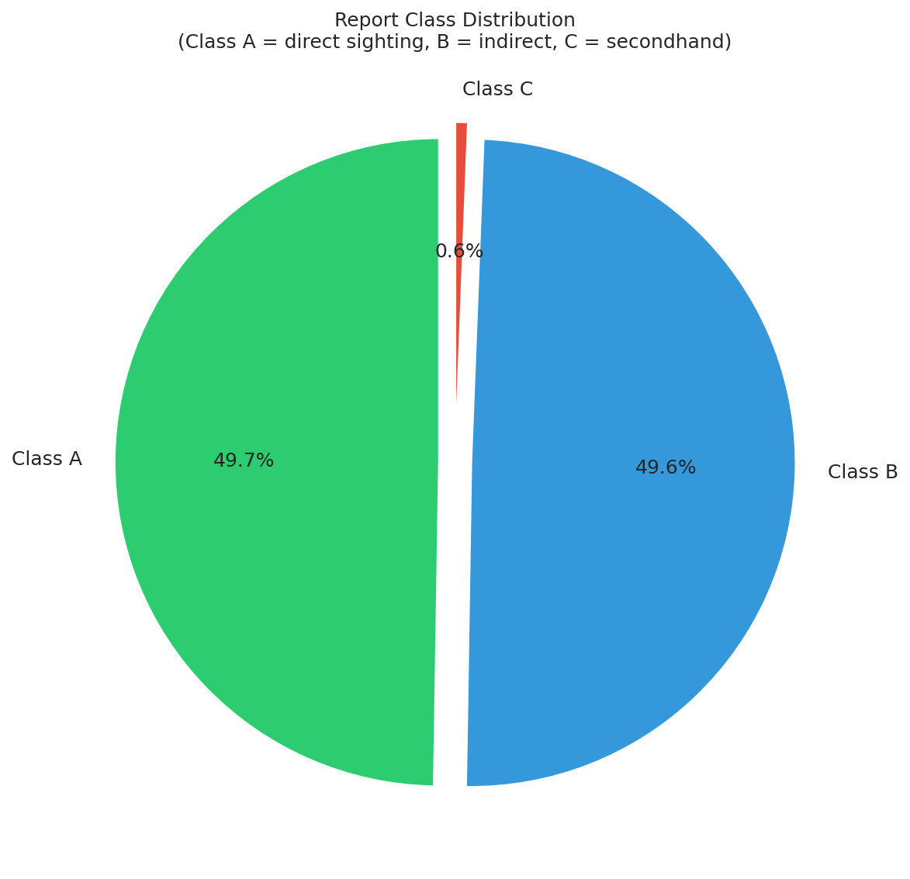
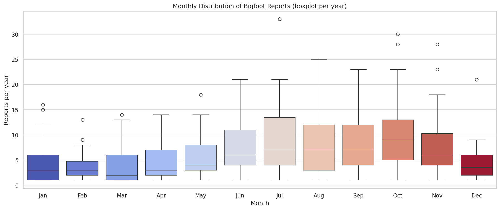
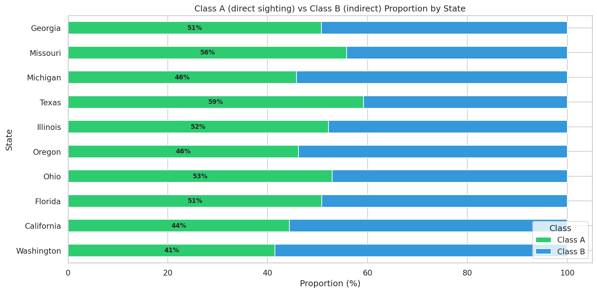
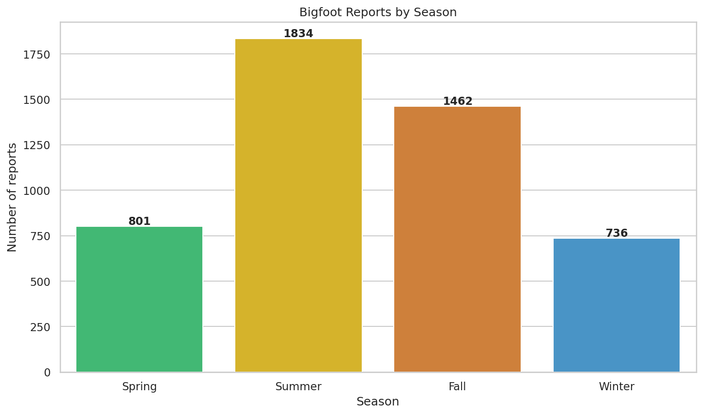

# Proiect AAD - Bigfoot Data Detective

## Echipa
- LUNGU Mihai-Teodor (341C3)
- FRATIMAN Bogdan-Gabriel (341C3)
- GRAUR Dan-Mihai (341C3)

## Dataset
- **Sursa**: [BFRO Bigfoot Sightings Data - Kaggle](https://www.kaggle.com/datasets/josephvm/bigfoot-sightings-data)
- **Dimensiune initiala**: 5467 randuri x 28 coloane
- **Dimensiune dupa curatare**: 4925 randuri x 12 coloane

## Motivatie
Am ales acest dataset pentru ca imbina folclorul urban cu date concrete
(geografice, temporale, categoriale). Scopul este sa analizam daca exista
tipare reale in raportarile Bigfoot sau daca fenomenul e explicabil prin
factori sociologici (media, activitate umana, confuzii cu fauna locala).

## Ipoteze de cercetare
- **H1**: Numarul de raportari a crescut semnificativ dupa expansiunea internetului.
- **H2**: Raportarile Bigfoot coreleaza cu populatia de ursi per stat.
- **H3**: Raportarile depind de anotimp, urmarind lunile in care oamenii ies mai mult in natura.

---

## Checkpoint 1 - Procesarea si Analiza Datelor

### 1.1 Incarcarea si Intelegerea Datelor
- Incarcarea CSV-ului cu pandas
- Verificarea dimensiunilor, tipurilor de date (`.shape`, `.info()`, `.dtypes`)
- Afisarea primelor/ultimelor randuri si a statisticilor descriptive
- Identificarea claselor de raportare:
  - **Class A**: observare directa clara
  - **Class B**: dovezi indirecte (sunete, urme)
  - **Class C**: informatii de mana a doua (surse neclare, povesti)

### 1.2 Curatarea Datelor

#### 1.2.1 Valori lipsa

Am aplicat urmatoarele strategii:

1. **Am sters coloanele cu peste 90% valori lipsa**: `Author`, `Media Source`, `Source Url`,
   `Media Issue`, `Observed.1`, `A & G References` - coloane specifice articolelor
   media, irelevante pentru analiza raportarilor.

2. **Am sters 451 randuri de tip "Media Article"**: acestea nu sunt raportari
   propriu-zise, ci articole de presa care nu au niciun camp relevant
   completat (Class, State, Season, County, Month, Year).

3. **Am sters coloana `Date`**: continea valori neutilizabile
   ("Friday night", "Mothers Day", "3").

4. **Am curatat coloana `Year`**:
   - Conversie la numar cu `pd.to_numeric`
   - Pentru valori text ca `"Late 1970's"`, `"Early 1990's"`: am extras
     cu regex primul numar de 4 cifre
   - Am filtrat anii invalizi (< 1800 sau > 2020)

5. **Parsare `Submitted Date`**: conversia stringurilor (ex: `"Saturday, November 12, 2005."`)
   la obiecte `datetime` reale (noua coloana `Submitted_Datetime`), ca sa le putem folosi in analize urmatoare.

6. **Tratare valori lipsa restante**: `Month`, `Nearest Town`, `Nearest Road`
   pastrate ca NaN (se exclud la analizele specifice, nu distorsioneaza distributiile).

#### 1.2.2 Valori aberante (Outliers)

- Metoda **IQR** aplicata pe coloana `Year`:
  - Q1 = 1986, Q3 = 2009, IQR = 23
  - Limite: [1951.5, 2043.5]
- Am pastrat outlier-ii sub limita inferioara (1870-1951) pentru ca
  sunt raportari istorice valide, nu erori de masurare.
- Am eliminat 91 de raportari cu `Year >= 2020` (date incomplete pentru anii
  recenti, ar fi distorsionat trendul temporal).

### 1.3 Analiza Statistica Descriptiva

Am calculat:
- **Distributii categoriale**: `Class` (Class A/B/C), `Season`, `Month`, `State`
- **Top 15 state** dupa numarul de raportari
- **Raportari per decada** (1870-2010)
- **Crosstab State x Class** (top 10 state, cu procent Class A)
- **Crosstab Season x Class**
- **Crosstab State x Season** (top 10 state)
- **Statistici anuale**: medie, mediana, max, min pe ultimii 30 ani

### 1.4 Vizualizari Exploratorii

8 grafice generate in folderul `output/`:

#### Grafic 1: Distributia raportarilor pe an (Boxplot + Histograma)

Boxplot-ul scoate in evidenta outlier-ii detectati cu IQR, iar histograma arata
distributia efectiva a raportarilor pe an.



#### Grafic 2: Top 15 state dupa numarul de raportari

Washington domina categoric (603 raportari), urmat de California si Ohio.



#### Grafic 3: Evolutia raportarilor in timp (1950 - prezent)

Se observa spike-ul major dupa 1995 (lansarea BFRO + internet), peak in 2000.



#### Grafic 4: Heatmap State x Sezon (top 10 state)

Raportarile se concentreaza in Summer + Fall pentru aproape toate statele;
Florida e singura exceptie cu multe raportari si iarna.



#### Grafic 5: Distributia Class A / B / C

Class A si Class B sunt aproape egale (~50% fiecare), Class C aproape neglijabila.



#### Grafic 6: Raportari pe luna (boxplot per an)

Peak in iulie-octombrie (sezon de camping si vanatoare), minim in decembrie-februarie.



#### Grafic 7: Proportia Class A vs Class B per stat

Washington si California (statele cu cei mai multi ursi) au cea mai mica proportie de Class A.



#### Grafic 8: Raportari pe sezon

Vara dubla fata de iarna (1865 vs 745), confirmand pattern-ul sezonier.



### 1.5 Ipoteze si Concluzii

**H1 - CONFIRMATA** (efectul internetului):
Raportarile au crescut masiv dupa lansarea BFRO (1995) si expansiunea internetului.
Anul de varf este 2000, urmat de o scadere dupa 2010. Nu e o
crestere reala a fenomenului, ci un efect de mediatizare si acces mai facil la
instrumentul de raportare.

**H2 - CONFIRMATA** (corelatie cu populatia de ursi):
Statele cu cele mai mari populatii de ursi negri (Washington, Oregon, California)
au cea mai mare rata de raportari totale, dar si cea mai mica rata de
Class A (~43%). Statele cu putini ursi (Texas, Ohio, Illinois) au ~55% Class A.
Ursii negri sunt animale mari, usor de confundat
cu Bigfoot, de unde predominanta Class B (dovezi indirecte).

**H3 - CONFIRMATA** (pattern sezonier legat de activitati outdoor):
67% din raportari sunt vara si toamna. Octombrie e luna cu cele mai multe
raportari (sezon de vanatoare), urmat de iulie-august (sezon de camping).
Frecventa urmareste recreerea afara.

### Concluzie generala
Datele sugereaza ca raportarile Bigfoot sunt un **fenomen sociologic** determinat de:
- Accesul la internet si la platforma BFRO
- Confuzia vizuala cu ursii negri
- Activitatile outdoor sezoniere (camping, vanatoare)

Nu exista dovezi concludente ca Bigfoot ar fi o creatura reala, ci mai degraba
un mit urban alimentat de factori culturali si naturali.

---

## Structura repo-ului

```
AAD-bigfoot/
├── archive.zip          # dataset raw (din Kaggle)
├── data/
│   └── reports.csv      # dataset dezarhivat
├── output/              # 8 grafice generate de script
├── checkpoint1.py       # scriptul principal pentru Checkpoint 1
├── requirements.txt     # dependinte Python
├── .gitignore
└── README.md            # acest fisier
```

## Rulare

```bash
python3 -m venv venv
source venv/bin/activate
pip install -r requirements.txt

unzip archive.zip -d data/

python3 checkpoint1.py
```

## Surse si referinte
- [BFRO Database Classification System](https://www.bfro.net/gdb/classify.asp)

