# Proiect AAD - Bigfoot Data Detective

## Echipa

- LUNGU Mihai-Teodor (341C3)
- FRATIMAN Bogdan-Gabriel (341C3)
- GRAUR Dan-Mihai (341C3)

## Dataset

- **Sursa**: [BFRO Bigfoot Sightings Data - Kaggle](https://www.kaggle.com/datasets/josephvm/bigfoot-sightings-data)
- **Dimensiune initiala**: 5467 randuri x 28 coloane
- **Dimensiune dupa curatare**: 4925 randuri x 12 coloane

## Motivatie

Am ales acest dataset pentru ca imbina folclorul urban cu date concrete
(geografice, temporale, categoriale). Scopul este sa analizam daca exista
tipare reale in raportarile Bigfoot sau daca fenomenul e explicabil prin
factori sociologici (media, activitate umana, confuzii cu fauna locala).

## Ipoteze de cercetare

- **H1**: Numarul de raportari a crescut semnificativ dupa expansiunea internetului.
- **H2**: Raportarile Bigfoot coreleaza cu populatia de ursi per stat.
- **H3**: Raportarile depind de anotimp, urmarind lunile in care oamenii ies mai mult in natura.

---

## Checkpoint 1 - Procesarea si Analiza Datelor

### 1.1 Incarcarea si Intelegerea Datelor

- Incarcarea CSV-ului cu pandas
- Verificarea dimensiunilor, tipurilor de date (`.shape`, `.info()`, `.dtypes`)
- Afisarea primelor/ultimelor randuri si a statisticilor descriptive
- Identificarea claselor de raportare:
  - **Class A**: observare directa clara
  - **Class B**: dovezi indirecte (sunete, urme)
  - **Class C**: informatii de mana a doua (surse neclare, povesti)

### 1.2 Curatarea Datelor

#### 1.2.1 Valori lipsa

Am aplicat urmatoarele strategii:

1. **Am sters coloanele cu peste 90% valori lipsa**: `Author`, `Media Source`, `Source Url`,
   `Media Issue`, `Observed.1`, `A & G References` - coloane specifice articolelor
   media, irelevante pentru analiza raportarilor.

2. **Am sters 451 randuri de tip "Media Article"**: acestea nu sunt raportari
   propriu-zise, ci articole de presa care nu au niciun camp relevant
   completat (Class, State, Season, County, Month, Year).

3. **Am sters coloana `Date`**: continea valori neutilizabile
   ("Friday night", "Mothers Day", "3").

4. **Am curatat coloana `Year`**:

   - Conversie la numar cu `pd.to_numeric`
   - Pentru valori text ca `"Late 1970's"`, `"Early 1990's"`: am extras
     cu regex primul numar de 4 cifre

   - Am filtrat anii invalizi (< 1800 sau > 2020)

5. **Parsare `Submitted Date`**: conversia stringurilor (ex: `"Saturday, November 12, 2005."`)
   la obiecte `datetime` reale (noua coloana `Submitted_Datetime`), ca sa le putem folosi in analize urmatoare.

6. **Tratare valori lipsa restante**: `Month`, `Nearest Town`, `Nearest Road`
   pastrate ca NaN (se exclud la analizele specifice, nu distorsioneaza distributiile).

#### 1.2.2 Valori aberante (Outliers)

- Metoda **IQR** aplicata pe coloana `Year`:
  - Q1 = 1986, Q3 = 2009, IQR = 23
  - Limite: [1951.5, 2043.5]
- Am pastrat outlier-ii sub limita inferioara (1870-1951) pentru ca
  sunt raportari istorice valide, nu erori de masurare.

- Am eliminat 91 de raportari cu `Year >= 2020` (date incomplete pentru anii
  recenti, ar fi distorsionat trendul temporal).

### 1.3 Analiza Statistica Descriptiva

Am calculat:

- **Distributii categoriale**: `Class` (Class A/B/C), `Season`, `Month`, `State`
- **Top 15 state** dupa numarul de raportari
- **Raportari per decada** (1870-2010)
- **Crosstab State x Class** (top 10 state, cu procent Class A)
- **Crosstab Season x Class**
- **Crosstab State x Season** (top 10 state)
- **Statistici anuale**: medie, mediana, max, min pe ultimii 30 ani

### 1.4 Vizualizari Exploratorii

8 grafice generate in folderul `output/`:

#### Grafic 1: Distributia raportarilor pe an (Boxplot + Histograma)

Boxplot-ul scoate in evidenta outlier-ii detectati cu IQR, iar histograma arata
distributia efectiva a raportarilor pe an.

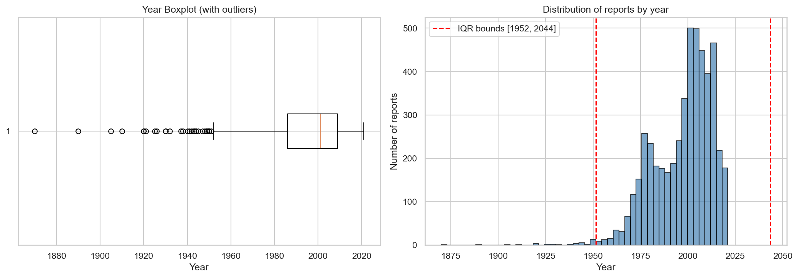

#### Grafic 2: Top 15 state dupa numarul de raportari

Washington domina categoric (603 raportari), urmat de California si Ohio.

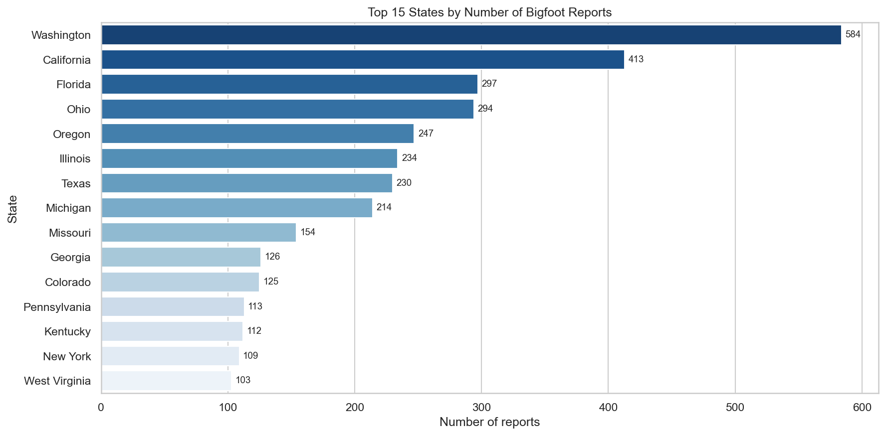

#### Grafic 3: Evolutia raportarilor in timp (1950 - prezent)

Se observa spike-ul major dupa 1995 (lansarea BFRO + internet), peak in 2000.

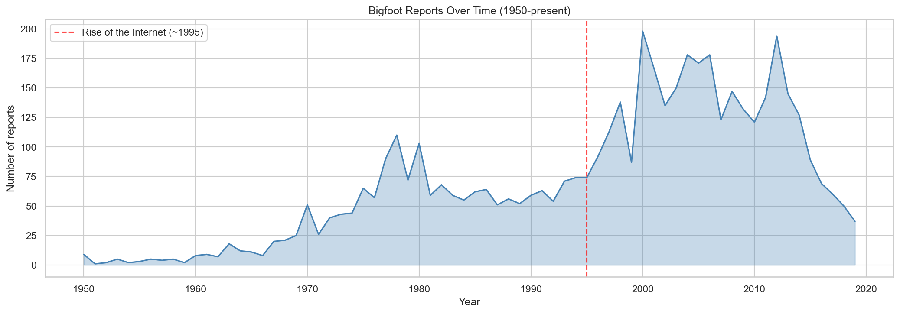

#### Grafic 4: Heatmap State x Sezon (top 10 state)

Raportarile se concentreaza in Summer + Fall pentru aproape toate statele;
Florida e singura exceptie cu multe raportari si iarna.

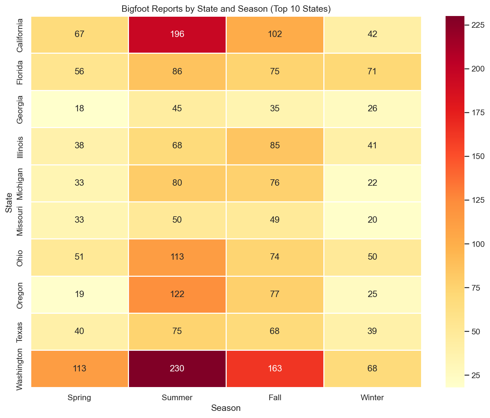

#### Grafic 5: Distributia Class A / B / C

Class A si Class B sunt aproape egale (~50% fiecare), Class C aproape neglijabila.

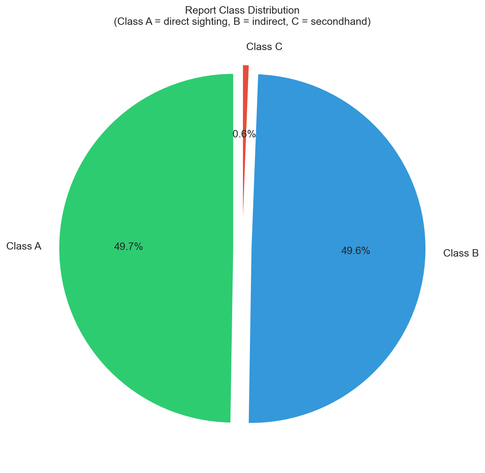

#### Grafic 6: Raportari pe luna (boxplot per an)

Peak in iulie-octombrie (sezon de camping si vanatoare), minim in decembrie-februarie.

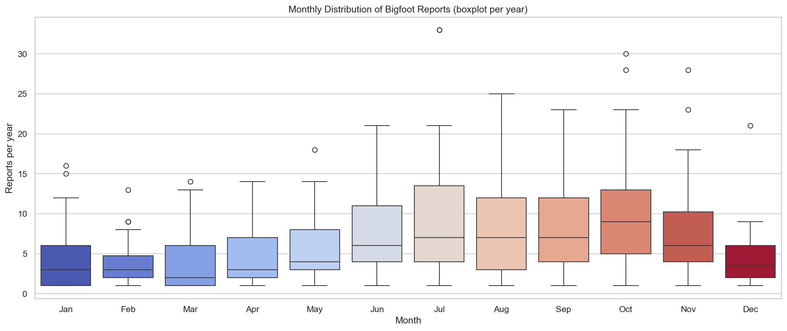

#### Grafic 7: Proportia Class A vs Class B per stat

Washington si California (statele cu cei mai multi ursi) au cea mai mica proportie de Class A.

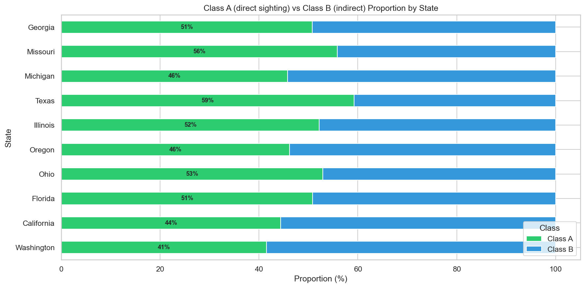

#### Grafic 8: Raportari pe sezon

Vara dubla fata de iarna (1865 vs 745), confirmand pattern-ul sezonier.

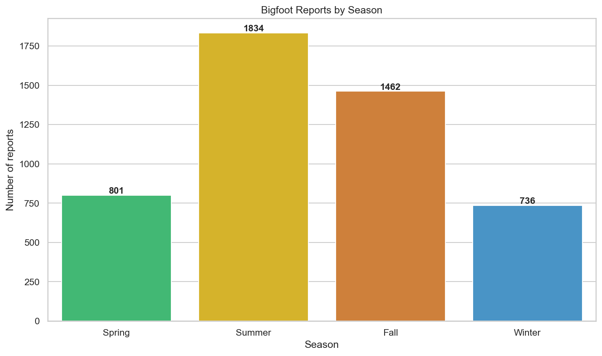

### 1.5 Ipoteze si Concluzii

**H1 - CONFIRMATA** (efectul internetului):
Raportarile au crescut masiv dupa lansarea BFRO (1995) si expansiunea internetului.
Anul de varf este 2000, urmat de o scadere dupa 2010. Nu e o
crestere reala a fenomenului, ci un efect de mediatizare si acces mai facil la
instrumentul de raportare.

**H2 - CONFIRMATA** (corelatie cu populatia de ursi):
Statele cu cele mai mari populatii de ursi negri (Washington, Oregon, California)
au cea mai mare rata de raportari totale, dar si cea mai mica rata de
Class A (~43%). Statele cu putini ursi (Texas, Ohio, Illinois) au ~55% Class A.
Ursii negri sunt animale mari, usor de confundat
cu Bigfoot, de unde predominanta Class B (dovezi indirecte).

**H3 - CONFIRMATA** (pattern sezonier legat de activitati outdoor):
67% din raportari sunt vara si toamna. Octombrie e luna cu cele mai multe
raportari (sezon de vanatoare), urmat de iulie-august (sezon de camping).
Frecventa urmareste recreerea afara.

### Concluzie generala

Datele sugereaza ca raportarile Bigfoot sunt un **fenomen sociologic** determinat de:

- Accesul la internet si la platforma BFRO
- Confuzia vizuala cu ursii negri
- Activitatile outdoor sezoniere (camping, vanatoare)

Nu exista dovezi concludente ca Bigfoot ar fi o creatura reala, ci mai degraba
un mit urban alimentat de factori culturali si naturali.

---

## Checkpoint 2 - Modelarea datelor

Aici am impartit munca pe 3 directii diferite, ca sa acoperim toate tipurile mari
de probleme ML studiate. Fiecare are taskul lui si lucreaza
independent.

### Task 1 - Predictia coloanei "Class" (A/B/C) folosind textul din descrierea articolului

Ideea de aici a pornit de la observatia ca cele 451 Media Articles, pe care le-am
scos in Checkpoint 1, au de fapt continut text care poate aduce un plus de valoare, si anume coloana `Observed.1`.
Am antrenat un model care sa completeze inapoi
coloana `Class` cu cele 451 valori prezise, ca sa avem un dataset augmentat.

Initial m-am gandit ca articolele sunt prin definitie Class C (BFRO defineste
Class C ca "secondhand reports", iar un articol e reprezentat de un jurnalist care
povesteste ce a auzit). Asta era ipoteza pe care voiam sa o validez.

#### Cum am facut preprocesarea

Reports si Media Articles au coloane diferite (Reports au `Observed`, Media au
`Observed.1`), dar continutul e similar - povestea evenimentului. Le-am
unificat intr-o singura coloana `text = Headline + (Observed sau Observed.1)`.

Am folosit `ColumnTransformer` ca sa procesez separat:

- **text** -> TF-IDF cu top 500 cuvinte si bigrame, fara stopwords engleze
- **Year** -> imputare cu mediana + StandardScaler

Train/test split impartit 80/20 ca sa pastreze proportia A/B/C.

#### Cele 3 modele

| Model | Setari | Cum tratez Class C |
| --- | --- | --- |
| Logistic Regression | `max_iter=1000` | `class_weight='balanced'` |
| Random Forest | 200 arbori, depth 20 | `class_weight='balanced'` |
| Gradient Boosting | 100 estimators | `sample_weight=80x` pentru C |

Class C are doar 30 raportari in tot dataset-ul (0.6%), asa ca a trebuit sa fortez
modelele sa o ia in seama.

#### Rezultate

| Model | Accuracy | F1 macro | F1 weighted |
| --- | --- | --- | --- |
| Gradient Boosting | **0.828** | 0.554 | 0.826 |
| Random Forest | 0.824 | 0.551 | 0.822 |
| Logistic Regression | 0.816 | 0.549 | 0.818 |

Rezultatele sunt similare, dar Gradient Boosting are un usor avantaj. Totusi, doar
Logistic Regression prezice cateva exemple de Class C (desi gresit), in timp ce celelalte modele nu prezic deloc Class C. Pentru ca scopul nostru e sa augmentam dataset-ul cu predictii pentru Media Articles, am ales Logistic Regression, ca sa avem macar cateva predictii de Class C, chiar daca nu sunt perfecte.

#### Aplicarea pe Media Articles

Cand am dat predict pe cele 451 Media Articles, fiecare model a iesit altfel:

| Model | Class A | Class B | Class C |
| --- | --- | --- | --- |
| Logistic Regression | 278 | 146 | **27** |
| Random Forest | 335 | 116 | 0 |
| Gradient Boosting | 308 | 143 | 0 |

Am ales LogReg pentru dataset-ul final, ca e singurul care prezice si Class C.
Distributia a iesit 62% A, 32% B, 6% C.

**Ipoteza initiala nu se confirma**: doar 6% din articole sunt clasificate ca
secondhand. Modelul "vede" continutul povestii (cineva a vazut sau cineva a
auzit?), nu formatul raportului. Articolele descriu de fapt evenimente de tip
Class A - cineva a vazut ceva direct, chiar daca articolul in sine e relatare.

#### Ce s-a schimbat fata de Checkpoint 1

Cu Media Articles incluse inapoi:

- Dataset total: 4925 -> **5376 randuri**
- Class C: 30 -> **57** (aproape dublat, de la 0.6% la 1.1%)

#### Grafice

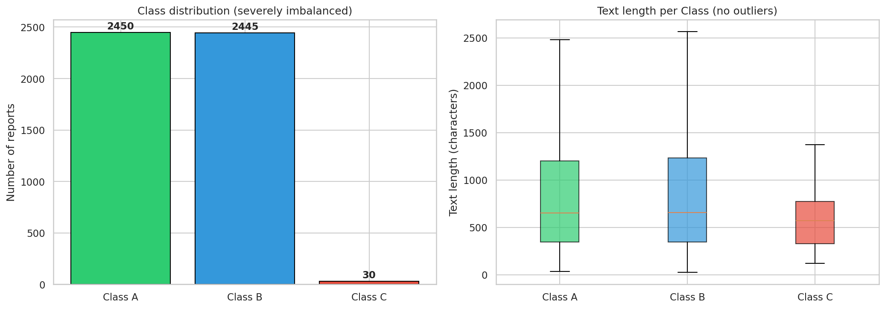

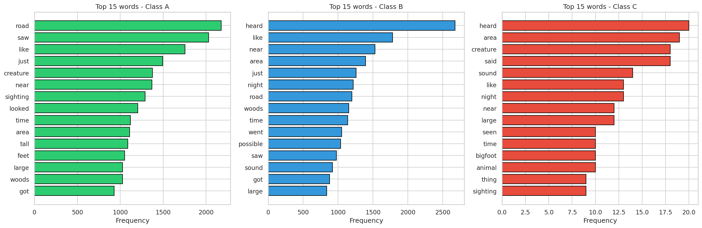

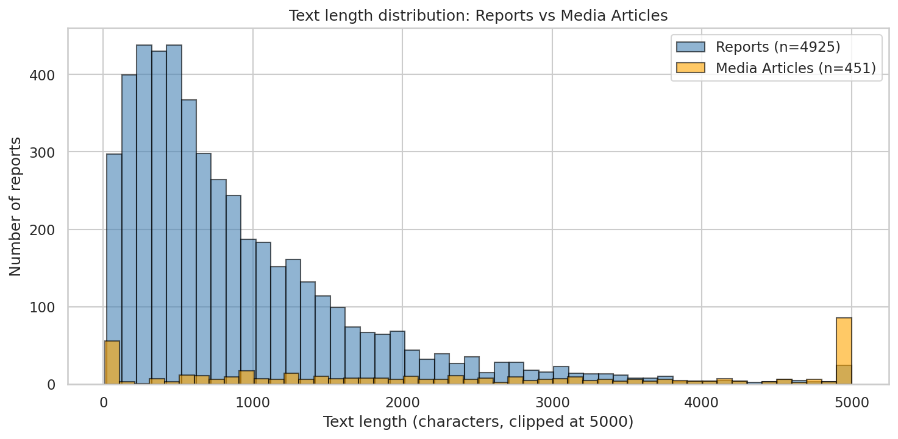

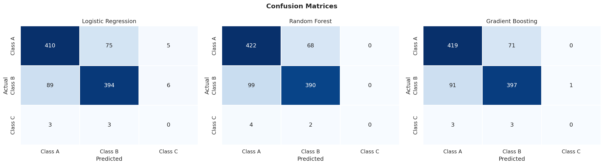

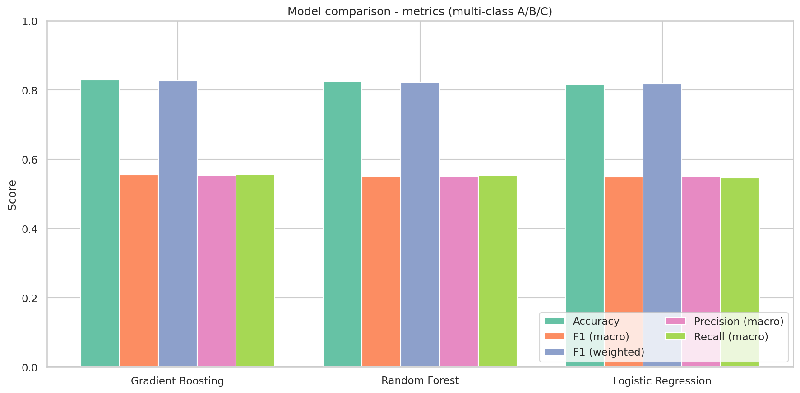

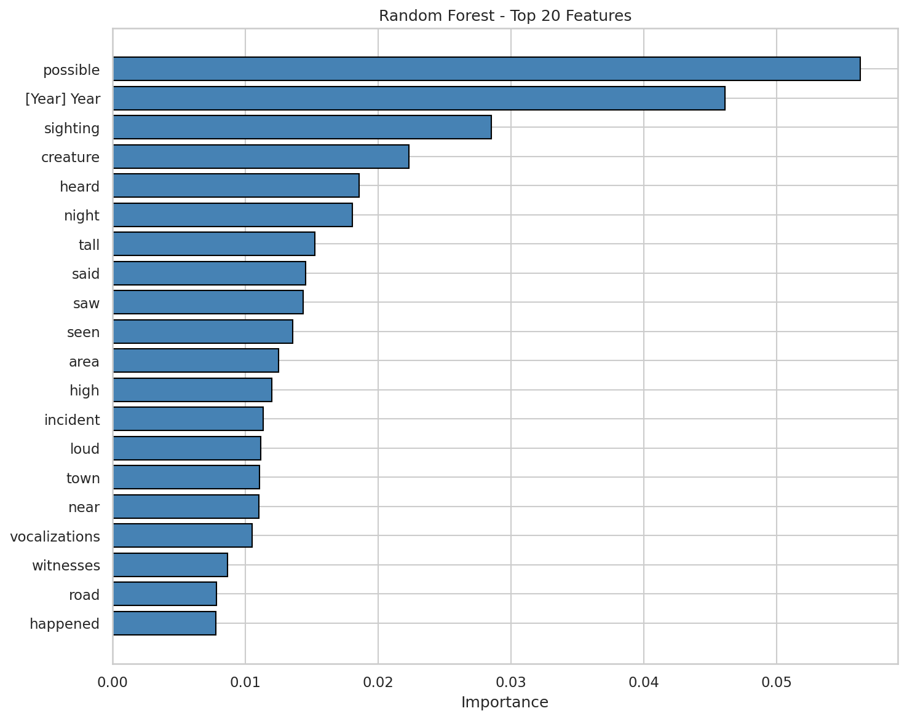

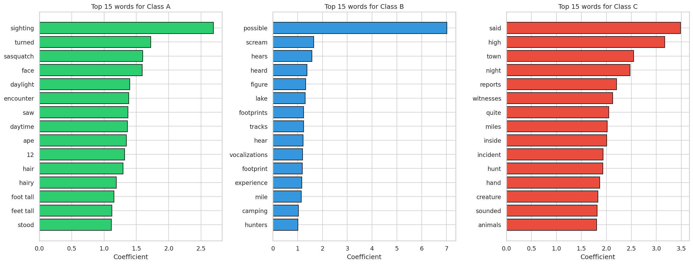

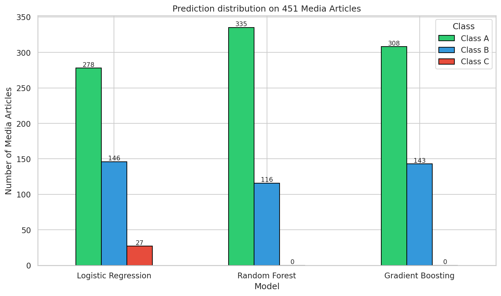

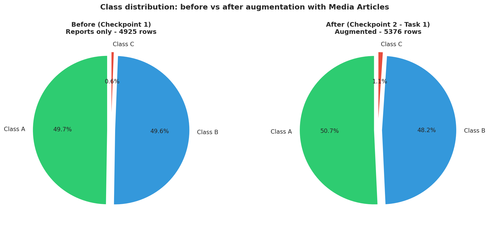

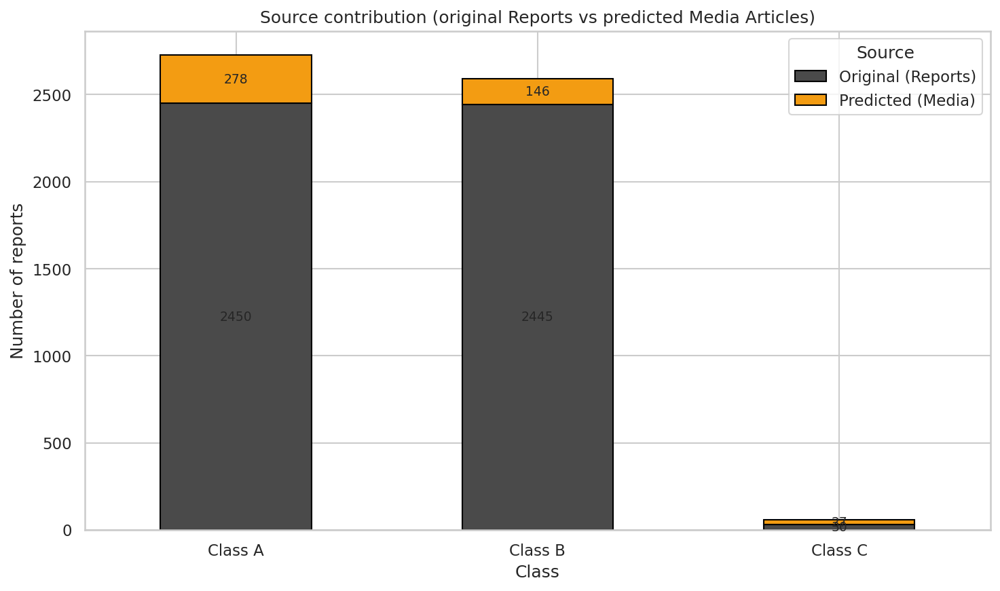

#### Concluzii

Modelele invata bine distinctia A vs B (~82%) pentru ca vocabularul e clar
diferit - "saw", "creature", "tall" pentru A vs "heard", "scream", "tracks"
pentru B. Class C ramane problematica, doar 24 sample-uri in train e prea
putin ca un model de text sa invete pattern-ul.

Faptul ca top words pe care le-a invatat LogReg corespund cu definitiile fiecarei clase e o validare
buna ca modelul a prins semantica reala, nu zgomot.

### Task 2 - Time Series Forecasting: Predicția raportărilor lunare

Ideea acestui task a fost să analizăm evoluția în timp a fenomenului Bigfoot și să verificăm dacă frecvența raportărilor poate fi modelată matematic. Scopul final a fost predicția numărului de raportări pentru următoarele 12 luni.

#### Cum am făcut preprocesarea datelor

Pentru a transforma setul de date într-o serie temporală (Time Series) coerentă:
- **Filtrare**: Am izolat datele între anii **1990 și 2019** pentru a avea un set consistent (eliminând anii prea vechi cu date rare și anul 2020 care era incomplet).
- **Agregare temporală**: Am grupat toate raportările la nivel lunar (folosind `resample('ME')`), obținând o serie continuă de 360 de luni.
- **Descompunere**: Am analizat separat Trendul, Sezonalitatea (care a confirmat din nou pattern-ul de vară/toamnă) și Reziduul (zgomotul).
- **Train/Test Split**: Am folosit primele 336 luni (1990-2017) pentru antrenare și **ultimele 24 de luni (2018-2019)** pentru testare și validarea modelelor.

#### Cele 3 modele comparate

Am folosit 3 abordări diferite pentru a modela această serie temporală:

1. **ARIMA (SARIMAX)**: Un model statistic clasic și puternic. Pe baza analizei graficelor ACF (Autocorrelation) și PACF (Partial Autocorrelation), am configurat un model care ține cont atât de autoregresie, cât și de sezonalitatea la 12 luni.
2. **Prophet**: Algoritmul dezvoltat de Meta, excelent pentru serii temporale cu sezonalitate puternică anuală și schimbări de trend.
3. **Linear Regression**: Un model de baseline simplu. Pentru a-l forța să înțeleagă "timpul", i-am extras manual caracteristici temporale (indexul lunii) și elemente ciclice (sinus/cosinus pe lună) ca variabile independente.

#### Rezultate și Evaluare

Am comparat performanța pe cele 24 de luni de test folosind **RMSE** (Root Mean Squared Error) și **MAE** (Mean Absolute Error).

| Model | Descriere scurtă | RMSE | MAE |
| --- | --- | --- | --- |
| **ARIMA (SARIMAX)** | Model statistic autoregresiv sezonier | **3.18** | **2.61** |
| **Prophet** | Model aditiv (Trend + Sezonalitate anuală) | 4.35 | 3.60 |
| **Linear Regression** | Regresie clasică cu funcții trigonometrice | 16.59 | 16.40 |

#### Concluzii

- **ARIMA a câștigat clar competiția**. Cu un RMSE de ~3.18, înseamnă că predicțiile modelului se abat în medie cu doar aproximativ 3 raportări față de numărul real de raportări pe lună din perioada de test. S-a mulat excelent pe istoricul recent al datelor.
- **Prophet** s-a descurcat foarte bine (RMSE 4.35), captând corect vârfurile de vară, deși a fost puțin mai conservator decât ARIMA pe setul specific de test. L-am ales însă pentru extrapolarea finală (forecast-ul viitor) datorită robusteții sale pe termen lung.
- **Linear Regression** a eșuat în a modela complexitatea seriei (RMSE 16.59). Funcțiile sinus/cosinus sunt prea rigide pentru a explica fluctuațiile reale.

#### Grafice

*(Fișiere generate automat în folderul `output/forecasting/`)*

**1. Descompunerea Seriei Temporale** Graficul arată clar sezonalitatea perfectă (vârfuri repetate anual) și trendul general (creșterea maximă în jurul anilor 2000-2010, urmată de o ușoară scădere).  
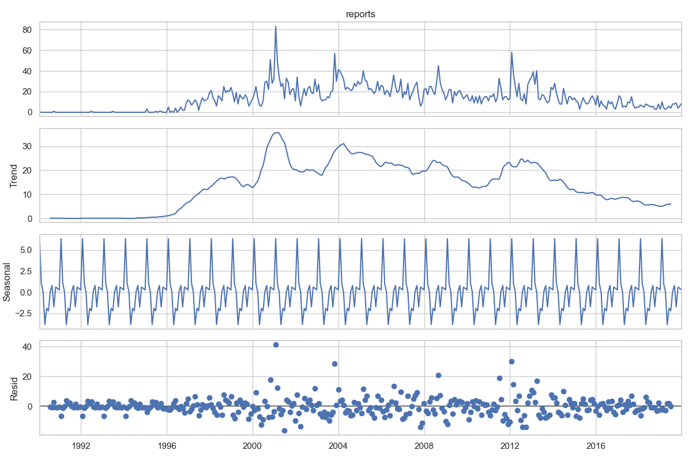

**2. Autocorelația (ACF și PACF)** Graficele folosite pentru determinarea ordinilor parametrilor (p, d, q) pentru modelul ARIMA. Spike-urile la intervale de 12 lag-uri confirmă sezonalitatea anuală puternică.  
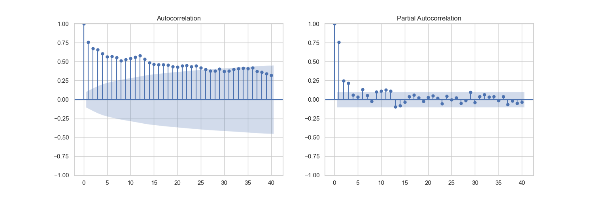

**3. Compararea Modelelor pe setul de Test** Se observă cum ARIMA (și Prophet parțial) reușesc să urmărească fidel linia neagră (datele reale) în ultimii 2 ani de testare, în timp ce Linear Regression subestimează fluctuațiile de vară.  
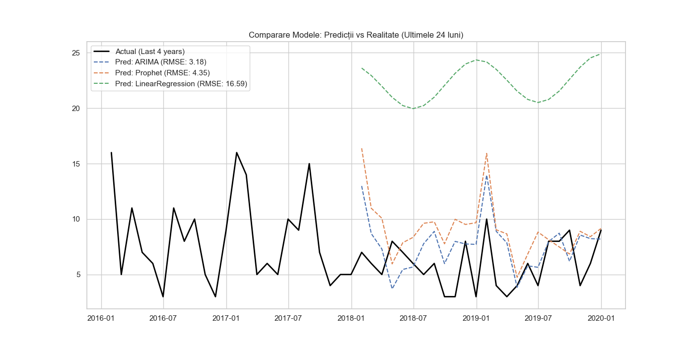

**4. Forecast pe următoarele 12 luni** Predicția finală generată cu Prophet pentru anul 2020. Modelul prezice menținerea aceluiași pattern ciclic, cu un vârf preconizat în lunile iulie-octombrie și un minim în lunile de iarnă, însoțit de banda de încredere (confidence interval).  
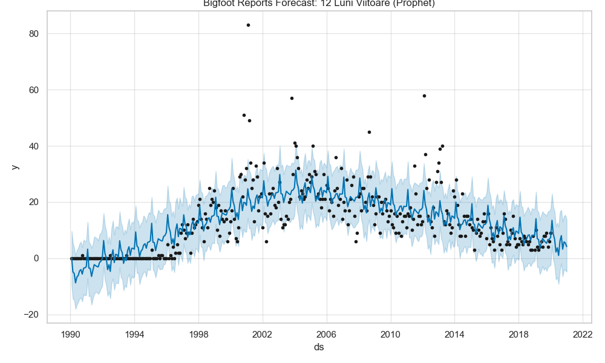

### Task 3 - Clustering: Descoperirea arhetipurilor de raportări

Ideea acestui task a fost să aplicăm învățare nesupervizată pentru a descoperi "grupuri naturale" sau arhetipuri în raportările Bigfoot. Am vrut să vedem dacă algoritmul poate grupa singur incidentele (de ex: "întâlniri vizuale de vară în Washington" vs. "sunete auzite toamna de vânători în Ohio"), folosind atât date tabelare, cât și vocabularul din text.

#### Cum am făcut preprocesarea și feature engineering-ul

Pentru a putea combina textul cu datele categoriale și geografice, am construit un spațiu de trăsături (features) hibrid:
- **State**: transformat prin *Frequency Encoding* (deoarece un stat ca Washington are mult mai multe raportări și contează frecvența lui relativă).
- **Season & Class**: transformate prin *One-Hot Encoding*.
- **Month**: transformat în valori numerice (1-12).
- **Text (Headline + Observed)**: extras prin *TF-IDF* (am păstrat doar top 50 de cuvinte cheie pentru a nu domina spațiul multidimensional).
- Datele au fost standardizate obligatoriu folosind `StandardScaler`.
- Am aplicat **PCA (Principal Component Analysis)** pentru a reduce spațiul la 2 componente principale, exclusiv pentru vizualizarea 2D a clusterelor.

#### Modele antrenate și Metrici

Am folosit metodele **Elbow** și **Silhouette Score** pentru a determina numărul optim de clustere, alegând **K=4** ca fiind un compromis bun între partiționarea clară și interpretabilitate. Am testat 3 algoritmi:

| Model | Caracteristici | Metrici urmărite |
| --- | --- | --- |
| **KMeans** | Iterativ, împarte datele în clustere sferice pe baza centroizilor. | Silhouette Score, Davies-Bouldin |
| **Agglomerative Clustering** | Ierarhic (folosind distanța Euclidiană și linkage Ward). | Silhouette Score, Davies-Bouldin |
| **DBSCAN** | Bazat pe densitate, util pentru a detecta outlierii (noise). | Silhouette Score pe punctele de bază |

*Notă: Deoarece spațiul de trăsături are peste 50 de dimensiuni (chiar și standardizat), KMeans și Agglomerative Clustering oferă o partiționare mai logică pentru extragerea de arhetipuri. DBSCAN a grupat majoritatea punctelor într-un cluster masiv și a marcat restul ca zgomot, datele nefiind suficient de dense/grupate izolat.*

#### Profilarea Clusterelor (Arhetipurile extrase de KMeans)

Analizând conținutul fiecărui cluster format de KMeans, am descoperit următoarele profiluri (arhetipuri) de raportări:

- **Cluster 0 (Grupul "Camping de Vară")**: Dominat puternic de sezonul **Summer** și **Class B**. Apare frecvent în state cu păduri dense. Cuvinte cheie extrase: *heard, night, tent, sound, woods*. Sunt incidentele clasice de camping unde oamenii aud zgomote neobișnuite noaptea.
- **Cluster 1 (Grupul "Întâlniri Vizuale - Class A")**: Dominat de **Class A**. Frecvent în **Washington** și **California**. Cuvinte cheie: *saw, road, crossed, creature, tall*. Reprezintă observațiile directe, adesea din mașină, unde martorii descriu fizic o creatură trecând drumul.
- **Cluster 2 (Grupul "Vânătorii de Toamnă")**: Dominat de **Fall** și luni ca Octombrie/Noiembrie. State precum **Ohio** sau **Illinois**. Cuvinte cheie: *hunting, deer, stand, heard, woods*. Acestea sunt raportările vânătorilor aflați în standuri, care aud pași grei sau vocalizări (Class B).
- **Cluster 3 (Grupul de Iarnă/Primăvară)**: O categorie mai restrânsă, dominată de **Winter** și **Spring**. Frecvent observat în state mai calde sau raportări de urme lăsate în zăpadă/noroi. Cuvinte cheie: *tracks, snow, footprints, found*.

#### Grafice

*(Fișiere generate automat în folderul `output/clustering/`)*

**1. Identificarea K-ului optim (Elbow Method & Silhouette)** Graficul ne arată unde scade inerția și unde avem un maxim local de coeziune pentru `K=4`.  
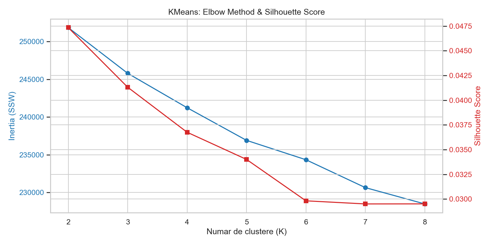

**2. Comparația algoritmilor de clustering în proiecție PCA 2D** Observăm cum KMeans și Agglomerative taie spațiul similar, în timp ce DBSCAN identifică un "core" mare și mulți outlieri.  
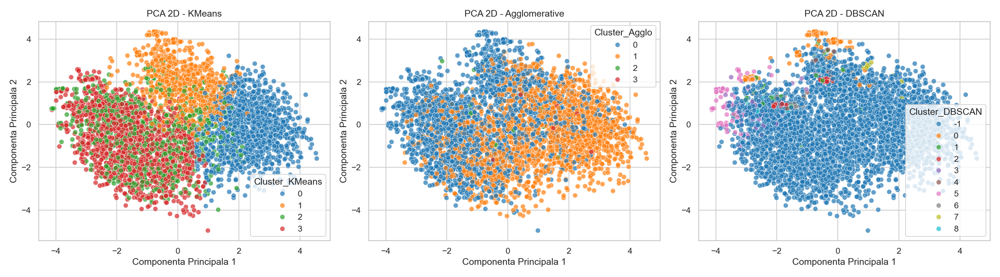

**3. Dendrograma (Agglomerative Clustering)** Arată modul ierarhic în care raportările se asamblează treptat pe baza distanței euclidiene.  
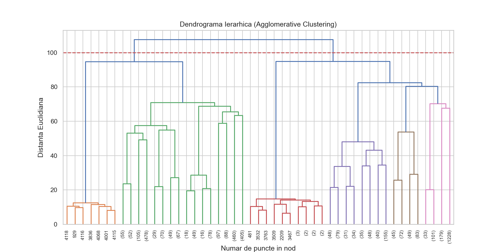

**4. Distribuția Sezoanelor și Claselor per Cluster** Validarea vizuală a profilelor: se observă cum anumite sezoane sau clase domină vizibil anumite clustere.  
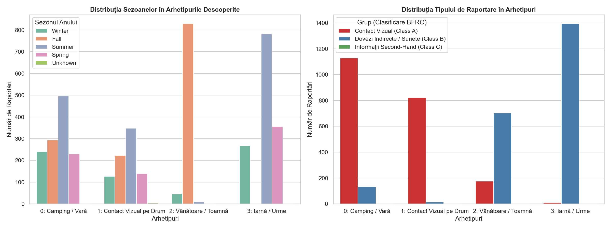

#### Concluzii
Analiza nesupervizată a confirmat descoperirile din faza de explorare (Checkpoint 1). Modelul a reușit să identifice automat, fără să fie instruit în prealabil, corelația puternică dintre "Vara/Toamna" + "Sunete (Class B)" + "Camping/Vânătoare" vs. "Creaturi văzute pe drum (Class A)". Aceasta ne întărește ipoteza conform căreia activitatea umană sezonieră dictează tiparul raportărilor.

---

## Structura repo-ului

```
AAD-bigfoot/
├── archive.zip                       # dataset raw (din Kaggle)
├── data/
│   ├── reports.csv                   # dataset dezarhivat
│   └── reports_augmented.csv         # output Task 1 (5376 randuri)
├── output/
│   ├── *.png                         # grafice Checkpoint 1
│   └── classification/               # grafice Checkpoint 2 - Task 1
├── checkpoint1.py                    # script Checkpoint 1
├── checkpoint2.py                    # script Checkpoint 2 (orchestreaza task-urile)
├── tasks/
│   ├── task1_classification.py       # FRATIMAN Bogdan
│   ├── task2_*.py                    # TBD
│   └── task3_*.py                    # TBD
├── requirements.txt                  # dependinte Python
├── .gitignore
└── README.md

```

## Rulare

### Setup initial (o singura data)

```bash
python3 -m venv venv
source venv/bin/activate
pip install -r requirements.txt

unzip archive.zip -d data/

```

### Rulare checkpoint-uri

```bash
# Checkpoint 1 (curatare date + EDA + vizualizari)

python3 checkpoint1.py

# Checkpoint 2 (modelarea datelor - ruleaza toate task-urile in ordine)

python3 checkpoint2.py

```

### Rulare task-uri individuale

```bash
# Doar Task 1 (clasificare Class A/B/C)

python3 tasks/task1_classification.py

```

## Surse si referinte

- [BFRO Database Classification System](https://www.bfro.net/gdb/classify.asp)

